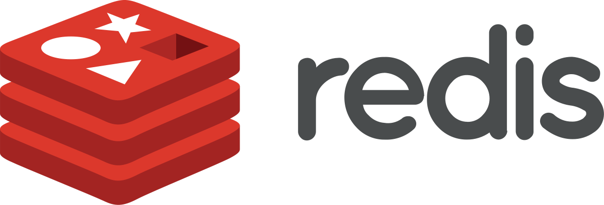
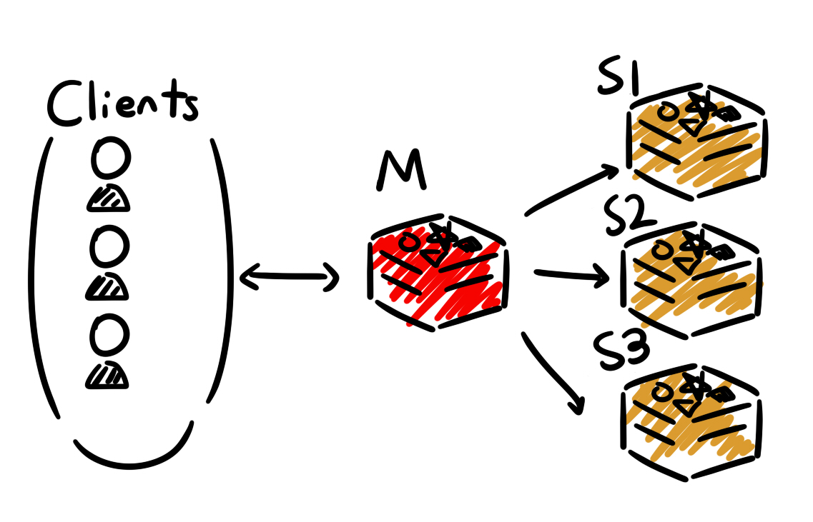

우리 회사에서는 Redis Cluster 환경을 사용하고 있다.

Redis Cluster의 환경과 일반 Redis의 형태와 어떤 차이인가 알게된 내용을 간단하게 회고하며 정리해본다.

이 글에서는 Redis에 대해서나 명령어에 대한 내용은 간략하게만 설명할 예정이다.

---

## Redis란 무엇인가?

Redis는 Remote Dictionary Server의 약자로, 인메모리 기반의 Key-Value의 DB이다.

### 풀어서 작성해보면?

위 처럼말 작성하면 복잡할 수 있으니 단어들을 풀어서 설명해보자면 다음과 같다.

**Remote(원격)** : 클라이언트가 Redis 서버에 **원격**으로 연결이 가능하다.

**Dictionary(사전)** : 데이터를 키-값(Key-Value) 쌍으로 저장하는 구조를 가진다.

**Server(서버)** : 클라이언트의 요청을 처리할 수 있도록 데이터에 대한 저장, 검색, 관리에 대한 역할을 수행한다.

**인메모리 기반** : 데이터들을 메모리 안에 저장하고 처리한다. 메모리 기반으로 되어있기 때문에 디스크 기반인 데이터베이스들 보다 빠른 속도를 제공한다.

이것에 대한 사용법들은 아래의 공식문서를 참고하거나, 다른 글을 찾아가는 것을 권장한다.

공식문서 Link : <a href="https://redis.io/docs/latest/develop/">공식문서</a>

## Redis Master/Slave

---
